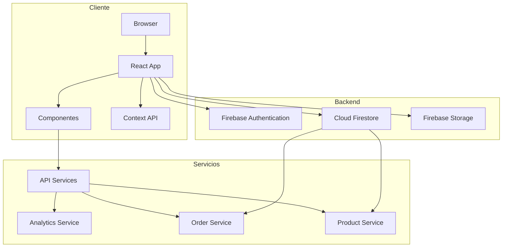
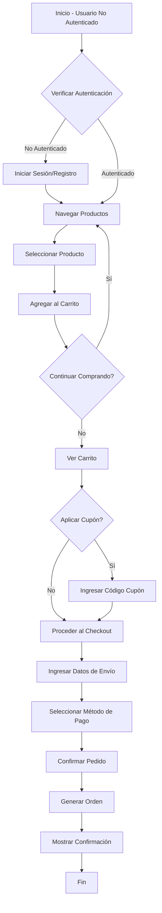
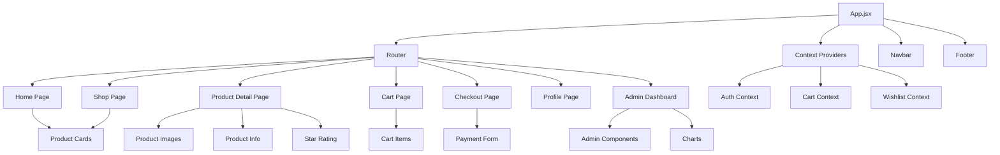
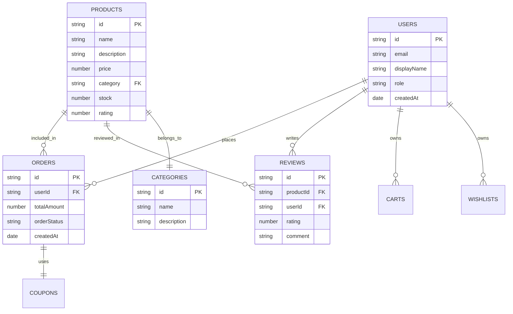

# Manual Técnico del Sistema PSG SHOP - Documentación Completa

## Tabla de Contenidos
1. [Introducción](#introducción)
2. [Arquitectura del Sistema](#arquitectura-del-sistema)
3. [Tecnologías Utilizadas](#tecnologías-utilizadas)
4. [Estructura del Proyecto](#estructura-del-proyecto)
5. [Componentes Principales](#componentes-principales)
6. [Flujos de Negocio](#flujos-de-negocio)
7. [Base de Datos y Modelos de Datos](#base-de-datos-y-modelos-de-datos)
8. [Seguridad y Autenticación](#seguridad-y-autenticación)
9. [APIs y Servicios](#apis-y-servicios)
10. [Interfaz de Usuario](#interfaz-de-usuario)
11. [Implementación y Despliegue](#implementación-y-despliegue)
12. [Pruebas y Mantenimiento](#pruebas-y-mantenimiento)

## Introducción

El sistema PSG SHOP es una aplicación de comercio electrónico completa desarrollada en React, que permite la gestión de productos, usuarios, pedidos y reseñas en una tienda online especializada en la venta de moños ("bows"). El sistema cuenta con dos tipos de usuarios: clientes regulares y administradores, cada uno con diferentes niveles de acceso y funcionalidades específicas.

### Objetivo del Sistema

El objetivo principal del sistema es proporcionar una plataforma de comercio electrónico que permita a los clientes navegar, buscar, comprar productos y dejar reseñas, mientras que los administradores puedan gestionar productos, pedidos, usuarios y estadísticas del negocio. El sistema está diseñado para ser escalable, seguro y fácil de usar tanto para clientes como para administradores.

## Arquitectura del Sistema

El sistema PSG SHOP sigue una arquitectura cliente-servidor moderna con las siguientes capas principales:

### Arquitectura Frontend (Cliente)
- **React 19**: Biblioteca principal para la construcción de interfaces de usuario
- **React Router DOM**: Sistema de enrutamiento para navegación entre páginas
- **Firebase SDK**: Cliente para comunicación directa con servicios de Firebase
- **Tailwind CSS**: Framework de estilos para diseño responsivo
- **Context API**: Gestión del estado global de la aplicación

### Arquitectura Backend (Servidor)
- **Firebase Authentication**: Autenticación de usuarios
- **Cloud Firestore**: Base de datos NoSQL para almacenamiento persistente
- **Firebase Storage**: Almacenamiento de archivos multimedia (imágenes)

### Patrón de Diseño
- **Component-Based Architecture**: Estructura modular basada en componentes reutilizables
- **Context Pattern**: Gestión de estado global sin librerías externas
- **Service Layer Pattern**: Lógica de negocio separada en servicios independientes

## Tecnologías Utilizadas

### Tecnologías Frontend
- **React 19**: Biblioteca JavaScript para construir interfaces de usuario
- **Vite**: Herramienta de construcción rápida para proyectos modernos de JavaScript
- **React Router DOM v7.9.1**: Enrutamiento declarativo para aplicaciones React
- **Firebase SDK v12.3.0**: Cliente para servicios de Google Firebase
- **Tailwind CSS v4.1.13**: Framework CSS utilitario para estilos rápidos
- **React Icons y Lucide React**: Bibliotecas de iconos para la interfaz de usuario
- **Recharts**: Biblioteca para gráficos y visualización de datos
- **SweetAlert2**: Librería para alertas y diálogos interactivos

### Tecnologías Backend
- **Firebase Authentication**: Sistema de autenticación con soporte para múltiples proveedores
- **Cloud Firestore**: Base de datos NoSQL en tiempo real y consultas avanzadas
- **Firebase Storage**: Almacenamiento de archivos en la nube

### Dependencias Principales
- `@formspree/react`: Integración con Formspree para formularios
- `@paypal/react-paypal-js`: Integración con PayPal para pagos
- `react-router-dom`: Enrutamiento entre vistas
- `firebase`: SDK oficial de Firebase
- `recharts`: Visualización de datos y estadísticas
- `sweetalert2`: Interacciones con el usuario

## Estructura del Proyecto

```
PSG SHOP/
├── public/
├── src/
│   ├── assets/
│   │   ├── pages/           # Páginas principales de la aplicación
│   │   └── routes/          # Configuración de rutas
│   ├── components/          # Componentes reutilizables
│   │   ├── charts/          # Componentes de gráficos
│   │   └── ...              # Otros componentes
│   ├── context/             # Contextos para manejo de estado
│   ├── hooks/               # Hooks personalizados
│   ├── services/            # Lógica de negocio y comunicación con backend
│   ├── utils/               # Utilidades y funciones auxiliares
│   ├── App.jsx              # Componente principal de la aplicación
│   ├── firebase.js          # Configuración de Firebase
│   ├── main.jsx             # Punto de entrada de la aplicación
│   └── App.css              # Estilos globales
├── .env                     # Variables de entorno
├── package.json             # Configuración del proyecto
├── README.md                # Documentación inicial
├── tailwind.config.js       # Configuración de Tailwind CSS
└── vite.config.js           # Configuración de Vite
```

## Componentes Principales

### Componentes de Página
- **Home.jsx**: Página de inicio con presentación de la tienda
- **Shop.jsx**: Catálogo de productos con filtros y búsqueda
- **ProductDetail.jsx**: Detalles completos de un producto específico
- **Cart.jsx**: Gestión del carrito de compras con cálculo de precios
- **Checkout.jsx**: Proceso de pago y finalización de compra
- **Profile.jsx**: Perfil de usuario con información personal
- **Orders.jsx**: Historial de pedidos del usuario
- **ModernAdminDashboard.jsx**: Panel de administración completo
- **Login.jsx y Register.jsx**: Autenticación de usuarios

### Componentes de Negocio
- **CartProvider**: Contexto para gestión del carrito de compras
- **WishlistProvider**: Contexto para gestión de lista de deseos
- **AuthContext**: Contexto para autenticación y autorización
- **OrderDetailsModal**: Modal para mostrar detalles de pedidos
- **CouponManager**: Gestión de cupones de descuento
- **StarRating**: Componente para calificaciones de productos

### Componentes de UI
- **navbar.jsx**: Barra de navegación principal
- **Footer.jsx**: Pie de página con información adicional
- **Loader.jsx**: Indicador de carga visual
- **Charts Components**: Gráficos para visualización de datos

## Flujos de Negocio

### Flujo de Compra para Clientes
1. **Registro/Inicio de Sesión**: El cliente se registra o inicia sesión
2. **Navegación y Búsqueda**: Explora productos en la tienda
3. **Detalle de Producto**: Selecciona un producto para ver detalles
4. **Agregar al Carrito**: Añade productos al carrito de compras
5. **Revisión del Carrito**: Verifica productos y aplica cupones
6. **Finalización de Compra**: Completa el proceso de pago
7. **Confirmación**: Recibe confirmación del pedido y detalles

### Flujo de Gestión para Administradores
1. **Autenticación**: Inicia sesión con credenciales de administrador
2. **Panel de Control**: Accede al dashboard administrativo
3. **Gestión de Productos**: CRUD de productos (crear, leer, actualizar, eliminar)
4. **Gestión de Pedidos**: Visualización y actualización de estados
5. **Gestión de Usuarios**: Supervisión y cambio de roles
6. **Gestión de Cupones**: Creación y administración de promociones
7. **Estadísticas**: Visualización de métricas y análisis

### Flujo de Reseñas
1. **Compra de Producto**: El cliente debe haber comprado el producto
2. **Dejar Reseña**: El cliente puede dejar una reseña con calificación
3. **Visualización**: Las reseñas se muestran públicamente en la página del producto
4. **Administración**: Los administradores pueden gestionar todas las reseñas

## Base de Datos y Modelos de Datos

### Colección: products
Almacena la información de los productos disponibles en la tienda.

```javascript
{
  id: string,                 // ID único generado por Firestore
  name: string,               // Nombre del producto
  description: string,        // Descripción detallada
  price: number,              // Precio en COP
  category: string,           // Categoría del producto
  imageUrls: [string],        // URLs de imágenes del producto (base64)
  primaryImageIndex: number,  // Índice de la imagen principal
  material: string,           // Material del producto
  color: string,              // Color del producto
  size: string,               // Tamaño del producto
  style: string,              // Estilo del producto
  stock: number,              // Cantidad disponible en inventario
  rating: number,             // Calificación promedio (0-5)
  createdAt: Date,            // Fecha de creación
  updatedAt: Date             // Fecha de última actualización
}
```

### Colección: users
Almacena la información de las cuentas de usuario y perfil.

```javascript
{
  id: string,                 // ID único de Firebase Authentication
  email: string,              // Correo electrónico del usuario
  displayName: string,        // Nombre para mostrar
  profileImage: string,       // URL de imagen de perfil
  role: 'customer' | 'admin', // Rol del usuario
  createdAt: Date,            // Fecha de creación de la cuenta
  addresses: [                // Direcciones guardadas del usuario
    {
      id: string,             // ID único de la dirección
      name: string,           // Nombre de la dirección
      street: string,         // Calle y número
      city: string,           // Ciudad
      state: string,          // Departamento/estado
      zipCode: string,        // Código postal
      country: string,        // País
      isDefault: boolean      // Si es la dirección predeterminada
    }
  ]
}
```

### Colección: orders
Almacena la información de los pedidos de los clientes.

```javascript
{
  id: string,                 // ID único generado por Firestore
  userId: string,             // ID del usuario que realizó el pedido
  userEmail: string,          // Correo del usuario para referencia
  items: [                    // Lista de productos en el pedido
    {
      id: string,             // ID del producto
      name: string,           // Nombre del producto
      price: number,          // Precio del producto
      quantity: number,       // Cantidad comprada
      imageUrl: string,       // Imagen del producto
      productId: string       // ID original del producto
    }
  ],
  subtotal: number,           // Subtotal antes de descuentos
  discount: number,           // Descuento aplicado
  totalAmount: number,        // Monto total después de descuentos
  totalAmountUSD: number,     // Monto total en dólares (para PayPal)
  address: {                  // Dirección de envío
    name: string,             // Nombre del destinatario
    street: string,           // Calle y número
    city: string,             // Ciudad
    state: string,            // Departamento/estado
    zipCode: string,          // Código postal
    country: string           // País
  },
  paymentMethod: string,      // Método de pago ('PayPal' | 'Cash on Delivery')
  paymentStatus: string,      // Estado del pago ('pending' | 'completed')
  orderStatus: string,        // Estado del pedido ('pending' | 'processing' | 'shipped' | 'delivered' | 'cancelled')
  coupon: object,             // Información del cupón aplicado (si existe)
  createdAt: Date,            // Fecha de creación del pedido
  updatedAt: Date             // Fecha de última actualización
}
```

### Colección: coupons
Almacena la información de los cupones de descuento.

```javascript
{
  id: string,                 // ID único generado por Firestore
  code: string,               // Código del cupón
  discountType: string,       // Tipo de descuento ('percentage' | 'fixed')
  discountValue: number,      // Valor del descuento
  isActive: boolean,          // Si el cupón está activo
  expiryDate: Date,           // Fecha de expiración (opcional)
  createdAt: Date             // Fecha de creación
}
```

### Colección: reviews
Almacena las reseñas de los productos de los clientes.

```javascript
{
  id: string,                 // ID único generado por Firestore
  productId: string,          // ID del producto reseñado
  userId: string,             // ID del usuario que dejó la reseña
  userName: string,           // Nombre del usuario para mostrar
  rating: number,             // Calificación (1-5 estrellas)
  comment: string,            // Comentario descriptivo
  createdAt: Date,            // Fecha de creación
  updatedAt: Date             // Fecha de última actualización
}
```

### Colección: categories
Almacena la información de las categorías de productos.

```javascript
{
  id: string,                 // ID único generado por Firestore
  name: string,               // Nombre de la categoría
  description: string,        // Descripción de la categoría
  imageUrl: string,           // URL de la imagen de la categoría
  createdAt: Date             // Fecha de creación
}
```

### Colección: carts
Almacena los datos del carrito de compras de los usuarios temporalmente.

```javascript
{
  userId: string,             // ID del usuario dueño del carrito
  items: [                    // Lista de productos en el carrito
    {
      id: string,             // ID del producto
      name: string,           // Nombre del producto
      price: number,          // Precio del producto
      quantity: number,       // Cantidad seleccionada
      imageUrl: string,       // Imagen del producto
      stock: number,          // Stock disponible
      productId: string       // ID original del producto
    }
  ],
  coupon: object,             // Cupón aplicado al carrito (si existe)
  updatedAt: Date             // Fecha de última actualización
}
```

## Seguridad y Autenticación

### Sistema de Autenticación
El sistema utiliza Firebase Authentication para manejar la autenticación de usuarios, lo que proporciona una solución segura y confiable para la identificación de usuarios. Soporta autenticación por correo electrónico y contraseña, y potencialmente otros proveedores como Google en el futuro.

### Control de Acceso Basado en Roles
El sistema implementa un control de acceso basado en roles con dos tipos de usuarios principales:
- **Clientes (customers)**: Acceso a funcionalidades básicas de compra y perfil
- **Administradores (admins)**: Acceso completo al panel de administración y funcionalidades avanzadas

### Protección de Rutas
El sistema implementa rutas protegidas mediante componentes como `ProtectedRoute` que verifican la autenticación del usuario antes de permitir el acceso a ciertas páginas como el perfil, el checkout, o el panel de administración.

### Validación de Datos
Todos los formularios incluyen validaciones tanto en el frontend como se espera en el backend para garantizar la integridad de los datos ingresados por los usuarios.

## APIs y Servicios

### Servicios de Backend
El sistema se comunica con Firebase Cloud Firestore para todas las operaciones de base de datos. Los servicios principales incluyen:

#### orderService.js
- [createOrder](file:///e:/Development/PSG%20SHOP/src/services/orderService.js#L45-L58): Crea un nuevo pedido
- [getOrdersByUserId](file:///e:/Development/PSG%20SHOP/src/services/orderService.js#L61-L108): Obtiene pedidos por ID de usuario
- [getOrderById](file:///e:/Development/PSG%20SHOP/src/services/orderService.js#L111-L125): Obtiene un pedido específico
- [updateOrderStatus](file:///e:/Development/PSG%20SHOP/src/services/orderService.js#L128-L139): Actualiza el estado de un pedido
- [getAllOrders](file:///e:/Development/PSG%20SHOP/src/services/orderService.js#L142-L199): Obtiene todos los pedidos (para admins)

#### productService.js
- [getProducts](file:///e:/Development/PSG%20SHOP/src/services/productService.js#L4-L18): Obtiene todos los productos
- [getProductById](file:///e:/Development/PSG%20SHOP/src/services/productService.js#L21-L35): Obtiene un producto específico
- [getProductsByCategory](file:///e:/Development/PSG%20SHOP/src/services/productService.js#L38-L52): Obtiene productos por categoría
- [createProduct](file:///e:/Development/PSG%20SHOP/src/services/productService.js#L55-L66): Crea un nuevo producto
- [updateProduct](file:///e:/Development/PSG%20SHOP/src/services/productService.js#L69-L82): Actualiza un producto existente
- [deleteProduct](file:///e:/Development/PSG%20SHOP/src/services/productService.js#L85-L94): Elimina un producto

#### userService.js
- [getAllUsers](file:///e:/Development/PSG%20SHOP/src/services/userService.js#L4-L20): Obtiene todos los usuarios
- [updateUserRole](file:///e:/Development/PSG%20SHOP/src/services/userService.js#L23-L39): Actualiza el rol de un usuario
- [updateUserProfile](file:///e:/Development/PSG%20SHOP/src/services/userService.js#L42-L58): Actualiza el perfil de un usuario

#### reviewService.js
- [getAllReviews](file:///e:/Development/PSG%20SHOP/src/services/reviewService.js#L4-L20): Obtiene todas las reseñas
- [deleteReview](file:///e:/Development/PSG%20SHOP/src/services/reviewService.js#L23-L34): Elimina una reseña
- [updateReview](file:///e:/Development/PSG%20SHOP/src/services/reviewService.js#L37-L50): Actualiza una reseña existente

#### analyticsService.js
- [getSalesData](file:///e:/Development/PSG%20SHOP/src/services/analyticsService.js#L4-L102): Obtiene datos de ventas
- [getSalesByCategory](file:///e:/Development/PSG%20SHOP/src/services/analyticsService.js#L105-L138): Obtiene ventas por categoría
- [getOrderStatusDistribution](file:///e:/Development/PSG%20SHOP/src/services/analyticsService.js#L141-L165): Distribución de estados de pedidos
- [getTopSellingProducts](file:///e:/Development/PSG%20SHOP/src/services/analyticsService.js#L168-L203): Productos más vendidos
- [getUserRegistrationData](file:///e:/Development/PSG%20SHOP/src/services/analyticsService.js#L206-L244): Datos de registro de usuarios
- [getRevenueByPaymentMethod](file:///e:/Development/PSG%20SHOP/src/services/analyticsService.js#L247-L277): Ingresos por método de pago

## Interfaz de Usuario

### Diseño Responsivo
El sistema está completamente adaptado para dispositivos móviles, tabletas y computadoras de escritorio, gracias al uso de Tailwind CSS y técnicas de diseño responsive. Todos los componentes se ajustan automáticamente al tamaño de pantalla del dispositivo del usuario.

### Experiencia de Usuario
- **Navegación Intuitiva**: Menú principal claro con categorías y funcionalidades principales
- **Búsqueda y Filtrado**: Sistema de búsqueda y filtrado de productos por categoría, precio y nombre
- **Carrito de Compras**: Sistema de carrito persistente que mantiene los productos entre sesiones
- **Proceso de Pago Simplificado**: Pasos claros y sencillos para completar compras
- **Feedback Visual**: Indicadores de carga, mensajes de éxito/error y confirmaciones

### Panel de Administración
El panel de administración cuenta con una interfaz moderna y completa que permite a los administradores gestionar todos los aspectos del sistema:
- **Dashboard de Estadísticas**: Métricas clave del negocio con gráficos interactivos
- **Gestión de Productos**: CRUD completo de productos con carga de imágenes
- **Gestión de Pedidos**: Seguimiento y actualización de estados de pedidos
- **Gestión de Usuarios**: Supervisión y cambio de roles de usuarios
- **Gestión de Cupones**: Creación y administración de promociones
- **Gestión de Reseñas**: Supervisión y edición de reseñas de productos
- **Temas y Preferencias**: Opciones de personalización de la interfaz

## Implementación y Despliegue

### Requisitos del Sistema
- **Node.js**: Versión 14 o superior
- **npm o yarn**: Para la gestión de paquetes
- **Cuenta de Firebase**: Para la base de datos y autenticación

### Configuración del Entorno
1. **Instalación de Dependencias**:
   ```bash
   npm install
   ```

2. **Configuración de Variables de Entorno**:
   Crear archivo `.env` en la raíz con las credenciales de Firebase:
   ```env
   VITE_API_KEY=tu-api-key
   VITE_AUTH_DOMAIN=tu-auth-domain
   VITE_PROJECT_ID=tu-project-id
   VITE_STORAGE_BUCKET=tu-storage-bucket
   VITE_MESSAGING_SENDER_ID=tu-messaging-sender-id
   VITE_APP_ID=tu-app-id
   ```

3. **Iniciar el Servidor de Desarrollo**:
   ```bash
   npm run dev
   ```

### Scripts Disponibles
- `npm run dev`: Inicia el servidor de desarrollo con recarga en caliente
- `npm run build`: Crea una versión optimizada para producción
- `npm run preview`: Previsualiza la versión de producción localmente
- `npm run deploy`: Despliega la aplicación en GitHub Pages

### Despliegue en Producción
El sistema está preparado para ser desplegado en plataformas como Vercel, Netlify o GitHub Pages. La configuración de Vite optimiza automáticamente el código para producción, minimizando archivos y optimizando recursos estáticos.

## Diagramas del Sistema

### Diagrama de Arquitectura



### Diagrama de Flujo de Compra



### Diagrama de Estructura de Componentes



### Diagrama ER (Entidad-Relación)



## Pruebas y Mantenimiento

### Tipos de Pruebas
- **Pruebas Unitarias**: Pruebas para componentes individuales y funciones de utilidad
- **Pruebas de Integración**: Pruebas para flujos completos de negocio
- **Pruebas de UI**: Validación de la interfaz de usuario en diferentes dispositivos
- **Pruebas de Seguridad**: Verificación de controles de acceso y validaciones

### Consideraciones de Mantenimiento
- **Actualizaciones de Dependencias**: Mantener las bibliotecas actualizadas para seguridad
- **Monitoreo de Rendimiento**: Supervisión de tiempos de carga y uso de recursos
- **Optimización de Consultas**: Mejora continua de las consultas a Firestore
- **Soporte Multiplataforma**: Asegurar compatibilidad con diferentes navegadores
- **Documentación Continua**: Actualización constante de la documentación técnica